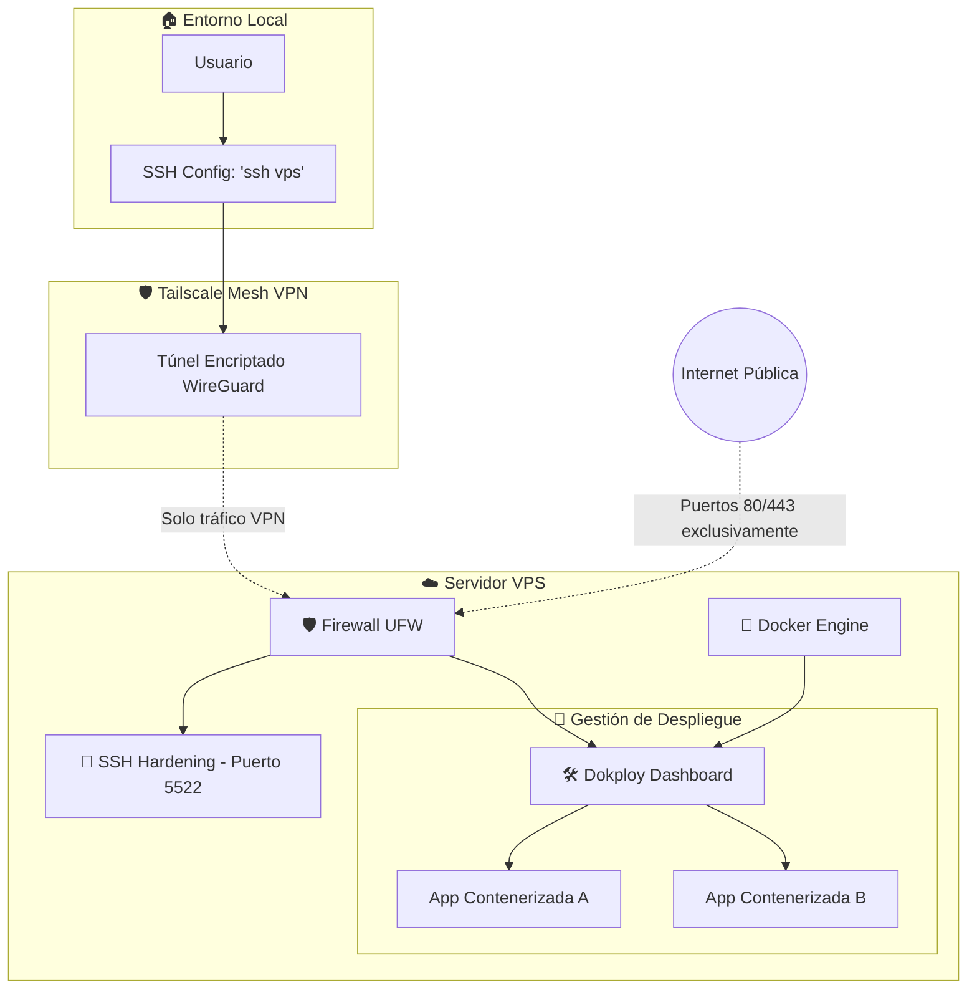

# 🚀 VPS Configuration & Hardening

Este repositorio contiene la guía y configuración necesaria para transformar un VPS virgen en una infraestructura de producción profesional, segura y fácil de gestionar mediante el uso de redes privadas y contenedores.

## 🏗️ Arquitectura del Sistema

El siguiente diagrama muestra cómo se estructura la seguridad y la conectividad del servidor:

## 🛠️ Stack Tecnológico

- **Sistema Operativo:** Ubuntu (o distribuciones basadas en Debian).
- **Red Privada:** [Tailscale](https://tailscale.com/) para acceso VPN zero-config.
- **Seguridad:** [UFW](https://wiki.ubuntu.com/UncomplicatedFirewall) (Firewall) y SSH Hardening.
- **Contenedores:** [Docker](https://www.docker.com/).
- **Orquestación/PaaS:** [Dokploy](https://dokploy.com/) para despliegues tipo Vercel/Netlify auto-hosteados.

## 📋 Resumen de la Configuración

El proceso se divide en 5 fases críticas documentadas en este repositorio:

1. **Fase 1: Hardening Inicial:** Gestión de usuarios no-root y configuración de llaves SSH.
2. **Fase 2: Conectividad Privada:** Implementación de Tailscale y MagicDNS para eliminar la exposición de puertos administrativos a internet.
3. **Fase 3: Seguridad Perimetral:** Configuración estricta de UFW y cambio de puerto SSH para evitar ataques de fuerza bruta.
4. **Fase 4: Infraestructura:** Instalación de Docker y el panel Dokploy.
5. **Fase 5: Optimización:** Flujo de trabajo móvil y backups.

---

Para ver el paso a paso detallado de la implementación, consulta la [Guía de Configuración](vps-configuration.md).
