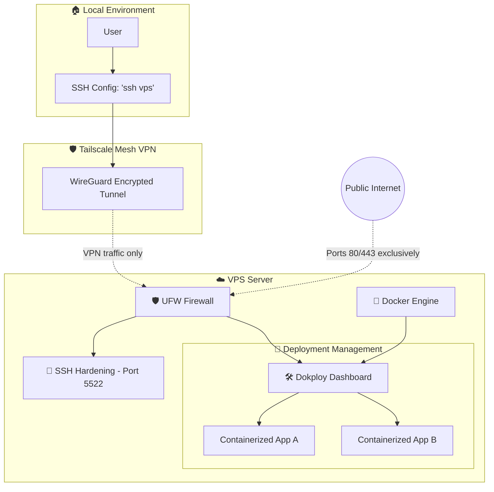

# 🚀 VPS Configuration & Hardening

[🇺🇸 English](README.md) | [🇪🇸 Español](../es/README.md)

This repository contains the guide and configuration necessary to transform a fresh VPS into a professional, secure, and easy-to-manage production infrastructure using private networks and containers.

## 🏗️ System Architecture

The following diagram shows how the server's security and connectivity are structured:

## 🛠️ Tech Stack

- **Operating System:** Ubuntu (or Debian-based distributions).
- **Private Network:** [Tailscale](https://tailscale.com/) for zero-config VPN access.
- **Security:** [UFW](https://wiki.ubuntu.com/UncomplicatedFirewall) (Firewall) and SSH Hardening.
- **Containers:** [Docker](https://www.docker.com/).
- **Orchestration/PaaS:** [Dokploy](https://dokploy.com/) for self-hosted Vercel/Netlify-like deployments.

## 📋 Configuration Summary

The process is divided into 5 critical phases documented in this repository:

1. **Phase 1: Initial Hardening:** Non-root user management and SSH key configuration.
2. **Phase 2: Private Connectivity:** Implementation of Tailscale and MagicDNS to eliminate administrative port exposure to the internet.
3. **Phase 3: Perimeter Security:** Strict UFW configuration and SSH port change to prevent brute force attacks.
4. **Phase 4: Infrastructure:** Installation of Docker and the Dokploy panel.
5. **Phase 5: Optimization:** Mobile workflow and backups.

---

To see the detailed step-by-step implementation, check the [Configuration Guide](vps-configuration.md).
